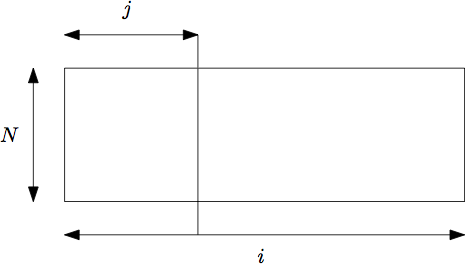

### [Lego Blocks](https://www.hackerrank.com/challenges/one-month-preparation-kit-lego-blocks/problem?isFullScreen=true&h_l=interview&playlist_slugs%5B%5D=preparation-kits&playlist_slugs%5B%5D=one-month-preparation-kit&playlist_slugs%5B%5D=one-month-week-four)

[Lego Blocks - Dynamic Programming](https://stackoverflow.com/questions/15424945/lego-blocks-dynamic-programming)
First, let's see how many $M * N$ walls can we build if we neglect the need to keep them connected:

We can treat each row separately, and then multiply the counts since they are independent.

There is only one way to tile a $0 * 1$ or a $1 * 1$ wall, and the number of ways to tile an $n * 1$ is the total of the number of ways to tile $\{n-1\} * 1...\{n-4\} * 1$-sized walls, the reason being these walls can be obtained by removing the last tile of the $n*1$ wall.

> 铺设 $0 * 1$ 或 $1 * 1$ 墙的方法只有一种，铺设 n*1 的方法是铺设{n-1} * 1...{n-4} * 1 大小的墙的方法的总和，原因是这些墙可以通过移除 $n * 1$ 墙的最后一块瓷砖得到。

This gives rise to a tetranacci sequence, [OEIS A000078](http://oeis.org/A000078). The number of all $W * H$ walls is $a(w,h)=T(w)^h$.

> 这就产生了一个特拉纳奇序列，[OEIS A000078](http://oeis.org/A000078)。所有 $W * H$ 墙的数量是 $a(w,h)=T(w)^h$。

Now, to count the number of solid walls. MBo's answer already contains the basic premise:

Branch on the leftmost place where the wall is not connected. The number of All $W * H$ walls is the number of Solid $X * H$ walls times the number of All $\{W - X\} * H$ walls, summed across all possible values of $X$, plus the number of Solid $W * H$ walls:

```javascript
A(W,H) = sum{X=1..{W-1}}(S(X,H)*A(W-X,H)) + S(W,H)
```

As a last step, we separate $S(M,H)$ term, which is the value we want to calculate, and repeat the previous formulas:

```javascript
S(W,H) = A(W,H) - sum_x( S(X,H)*A(W-X,H) ) //implicitly, S(1,H)=1

A(W,H) = T(W)^H

T(X)   = X > 0: T(X-1)+T(X-2)+T(X-3)+T(X-4)
         X = 0: 1
         X < 0: 0
```         
(proving MBo's formula correct).

This also provides an `O(W^2)` algorithm to compute `S` (assuming proper memoization and constant-time arithmetic operations)

[combination problem on Lego blocks](https://math.stackexchange.com/questions/1841028/combination-problem-on-lego-blocks)

> You have 4 types of lego blocks, of sizes given in $length \times width \times height$ as $1 \times 1 \times 1$, $2 \times 1 \times 1$, $3 \times 1 \times 1$, and $4 \times 1 \times 1$. Assume that you have an infinite number of blocks of each type.
> Using these blocks, you want to make a wall that is rectangular parallelepiped of height N and length M and width 1 without any holes and notches. The wall you build should be one solid structure. A solid structure can be interpreted in one of the following ways:
> It should not be possible to separate the wall along any vertical cut without cutting any lego block used to build the wall.
> You cannot make a vertical cut from top to bottom without cutting one or more lego blocks.
> The blocks can only be placed in such a way that the lenght, width and height of a block are parallel to the length, width and height of the wall. In how many ways can the wall be built?

From this follows that the third dimension of the wall is $1$ because it is explicitly mentioned. I think one cannot get this from the original text if one does not make some assumptions based on the experience with building lego walls in the childhood.

Because the problem is not affected by the width it can be view as a two dimensional tiling problem, And because height dimension of the blocks also does not affect the problem, it can be viewed as one dimensional problem.

[based on official editorial](https://www.hackerrank.com/challenges/one-month-preparation-kit-lego-blocks/editorial)
By projecting the wall onto 2D plane, the question becomes how to use $1 \times 1, 1 \times 2, 1 \times 3$ and $1 \times 4$ lego blocks to solidly cover a $H \times W$ rectangle without any holes or overlapping.

Please refer to the figure below for an example of the first test case, where the first three embeddings are valid, but the last is not since it is not solid.

#### $n: 2 \quad m: 2$

Good layouts

<svg width="340" height="100" viewBox="0 0 340 100" fill="none" xmlns="http://www.w3.org/2000/svg">
<rect x="0.5" y="50.5" width="99" height="49" fill="white" stroke="black"/>
<rect x="0.5" y="0.5" width="99" height="49" fill="white" stroke="black"/>
<rect x="120.5" y="0.5" width="49" height="49" fill="white" stroke="black"/>
<rect x="170.5" y="0.5" width="49" height="49" fill="white" stroke="black"/>
<rect x="120.5" y="50.5" width="99" height="49" fill="white" stroke="black"/>
<rect x="240.5" y="50.5" width="49" height="49" fill="white" stroke="black"/>
<rect x="290.5" y="50.5" width="49" height="49" fill="white" stroke="black"/>
<rect x="240.5" y="0.5" width="99" height="49" fill="white" stroke="black"/>
</svg>

Bad layouts

<svg width="100" height="100" viewBox="0 0 100 100" fill="none" xmlns="http://www.w3.org/2000/svg">
<rect x="0.5" y="0.5" width="49" height="49" fill="white" stroke="black"/>
<rect x="0.5" y="50.5" width="49" height="49" fill="white" stroke="black"/>
<rect x="50.5" y="0.5" width="49" height="49" fill="white" stroke="black"/>
<rect x="50.5" y="50.5" width="49" height="49" fill="white" stroke="black"/>
</svg>

<br/><br/>

Before solving this problem, let's consider a simpler version, which ignores the solid condition for a while. Now, the problem is decomposable, i.e., each row is an independent (same) subproblem. In other words, if we use $f[i]$ to denote # of ways to cover a $1 \times i$ bar, and let $g[i]$ be # of ways to cover a $N \times i$ rectangle ignoring the "solid" condition. Then,

$\Large g[i] = f[i]^N$

**Recurrence of $f[i]$**

Since there cannot be any holes for the embedding, we have to put a lego-slice (**_note that_**, we only have 4 types of lego blocks $1 \times 1, 1 \times 2, 1 \times 3$ and $1 \times 4$), say $1 \times k$ (**_so that_** $k \in 1, 2, 3, 4$), at the very left of the bar. Then, the length of the uncovered bar becomes $i \times k$, and obviously we have $f[i - k]$ different ways to cover. Therefore,

$
f[i] = 
\begin{cases}
f[i - 1] + f[i - 2] + f[i - 3] + f[i - 4] &\text{if } i > 0\\
1 &\text{if } i = 0\\
0 &\text{if } i < 0
\end{cases}
$

Let's list some cases:

$
f[1] = 1 =
\begin{cases}
    \begin{rcases}
        1
    \end{rcases} f[0]
\end{cases}
$

$
f[2] = 2 =
\begin{cases}
    \begin{rcases}
        1 \space 1
    \end{rcases} f[1]\\
    \begin{rcases}
        2
    \end{rcases} f[0]
\end{cases}
$

$
f[3] = 4 =
\begin{cases}
    \begin{rcases}
        1 \space 1 \space 1\\
        1 \space 2\\
    \end{rcases} f[2]\\
    \begin{rcases}
        2 \space 1
    \end{rcases} f[1]\\
    \begin{rcases}
        3 \space
    \end{rcases} f[0]
\end{cases}
$

$
f[4] = 8 =
\begin{cases}
    \begin{rcases}
        1 \space 1 \space 1 \space 1\\
        1 \space 1 \space 2\\
        1 \space 2 \space 1\\
        1 \space 3\\
    \end{rcases} f[3]\\
    \begin{rcases}
        2 \space 1 \space 1\\
        2 \space 2
    \end{rcases} f[2]\\
    \begin{rcases}
        3 \space 1
    \end{rcases} f[1]\\
    \begin{rcases}
        4
    \end{rcases} f[0]
\end{cases}
$

$
f[5] = 8 =
\begin{cases}
    \begin{rcases}
        1 \space 1 \space 1 \space 1 \space 1\\
        1 \space 1 \space 1 \space 2\\
        1 \space 1 \space 2 \space 1\\
        1 \space 1 \space 3\\
        1 \space 2 \space 1 \space 1\\
        1 \space 2 \space 2\\
        1 \space 3 \space 1\\
        1 \space 4\\
    \end{rcases} f[4]\\
    \begin{rcases}
        2 \space 1 \space 1 \space 1\\
        2 \space 1 \space 2\\
        2 \space 2 \space 1\\
        2 \space 3
    \end{rcases} f[3]\\
    \begin{rcases}
        3 \space 1 \space 1\\
        3 \space 2
    \end{rcases} f[2]\\
    \begin{rcases}
        4 \space 1
    \end{rcases} f[1]
\end{cases}
$

Now you should understand why this formula is true, why $f[0] = 1$. These two why are very important. If you don't still understand. please tell me.

**Back to the primal problem**

$g[M]$ gives us # of ways to embed a $N \times M$ block without the "solid" condition. However, we can easily remove those invalid (unsolid) cases from $g[M]$. Let $h[i]$ denote # of solid embedding of a $N \times i$ retangle.

For those unsolid embedding of $N \times i$ size , we enumerate all the leftmost cuts that split the wall into two parts without damaging any lego-slices. Assume the block to the left of the cut has width $j$. the current cut (see the figure below), and consequently, the one to the right has width $i - j$. Since the cut we just made is assumed to be the leftmost one, the left block has to be a solid (valid) one, and hence has $h[j]$ different ways of embedding. On the other hand, there is no particular constraint on the right one, and thus $g[i - j]$ choices.



In such a case, the rule of product applies, and therefore

$h[i] = g[i] - \displaystyle\sum_{j=1}^{i-1} h[j] * g[i-j]$

1. $g[i] = h[i] + \displaystyle\sum_{j=1}^{i-1} h[j] * g[i-j]$
2. $g[1] = h[1] = 1$ (no matter what $N$ is).

> Note
> In the real life,
> * we only have 2 ways to divide lego block: from the left to right or from the right to left. Now we choose "**from the left to right**". Because if you divide from the two side, we can not eliminate counting of repetitive variants or say it is very difficult task.
> * now we only can divide intact part that is solid structure.

Let's list some cases: $N = 1,2,3,4,5$ for $H[1]$ from left to right.

<svg width="370" height="250" viewBox="0 0 370 250" fill="none" xmlns="http://www.w3.org/2000/svg">
<rect x="0.5" y="0.5" width="49" height="49" fill="white" stroke="black"/>
<rect x="80.5" y="0.5" width="49" height="49" fill="white" stroke="black"/>
<rect x="80.5" y="50.5" width="49" height="49" fill="white" stroke="black"/>
<rect x="160.5" y="50.5" width="49" height="49" fill="white" stroke="black"/>
<rect x="240.5" y="50.5" width="49" height="49" fill="white" stroke="black"/>
<rect x="320.5" y="50.5" width="49" height="49" fill="white" stroke="black"/>
<rect x="240.5" y="150.5" width="49" height="49" fill="white" stroke="black"/>
<rect x="320.5" y="150.5" width="49" height="49" fill="white" stroke="black"/>
<rect x="160.5" y="100.5" width="49" height="49" fill="white" stroke="black"/>
<rect x="240.5" y="100.5" width="49" height="49" fill="white" stroke="black"/>
<rect x="320.5" y="100.5" width="49" height="49" fill="white" stroke="black"/>
<rect x="320.5" y="200.5" width="49" height="49" fill="white" stroke="black"/>
<rect x="160.5" y="0.5" width="49" height="49" fill="white" stroke="black"/>
<rect x="240.5" y="0.5" width="49" height="49" fill="white" stroke="black"/>
<rect x="320.5" y="0.5" width="49" height="49" fill="white" stroke="black"/>
</svg>


You only can place $1 \times 1$ one by one to make a wall to shape height $N$, we have no less than $1 \times 1$ lego blocks, and we can not divide $1 \times 1$ lego block. so it is solid. so the number of valid $ N \times 1$ wall is $1$.

**Let's list some cases: $N = 3$ for $H[2]$.**

*Good layouts:*

(you can not divide intact part for $ 3 \times 1$, or say it can not be divided vertically across all rows.)

<svg width="490" height="330" viewBox="0 0 490 330" fill="none" xmlns="http://www.w3.org/2000/svg">
<rect x="0.5" y="0.5" width="49" height="49" fill="white" stroke="black"/>
<rect x="0.5" y="50.5" width="49" height="49" fill="white" stroke="black"/>
<rect x="50.5" y="0.5" width="49" height="49" fill="white" stroke="black"/>
<rect x="50.5" y="50.5" width="49" height="49" fill="white" stroke="black"/>
<rect x="0.5" y="100.5" width="99" height="49" fill="white" stroke="black"/>
<rect x="130.5" y="0.5" width="49" height="49" fill="white" stroke="black"/>
<rect x="130.5" y="100.5" width="49" height="49" fill="white" stroke="black"/>
<rect x="180.5" y="0.5" width="49" height="49" fill="white" stroke="black"/>
<rect x="180.5" y="100.5" width="49" height="49" fill="white" stroke="black"/>
<rect x="130.5" y="50.5" width="99" height="49" fill="white" stroke="black"/>
<rect x="260.5" y="0.5" width="49" height="49" fill="white" stroke="black"/>
<rect x="310.5" y="0.5" width="49" height="49" fill="white" stroke="black"/>
<rect x="260.5" y="50.5" width="99" height="49" fill="white" stroke="black"/>
<rect x="260.5" y="100.5" width="99" height="49" fill="white" stroke="black"/>
<rect x="390.5" y="50.5" width="49" height="49" fill="white" stroke="black"/>
<rect x="390.5" y="100.5" width="49" height="49" fill="white" stroke="black"/>
<rect x="440.5" y="50.5" width="49" height="49" fill="white" stroke="black"/>
<rect x="440.5" y="100.5" width="49" height="49" fill="white" stroke="black"/>
<rect x="390.5" y="0.5" width="99" height="49" fill="white" stroke="black"/>
<rect x="0.5" y="280.5" width="49" height="49" fill="white" stroke="black"/>
<rect x="50.5" y="280.5" width="49" height="49" fill="white" stroke="black"/>
<rect x="0.5" y="180.5" width="99" height="49" fill="white" stroke="black"/>
<rect x="0.5" y="230.5" width="99" height="49" fill="white" stroke="black"/>
<rect x="130.5" y="230.5" width="49" height="49" fill="white" stroke="black"/>
<rect x="180.5" y="230.5" width="49" height="49" fill="white" stroke="black"/>
<rect x="130.5" y="180.5" width="99" height="49" fill="white" stroke="black"/>
<rect x="130.5" y="280.5" width="99" height="49" fill="white" stroke="black"/>
<rect x="260.5" y="180.5" width="99" height="49" fill="white" stroke="black"/>
<rect x="260.5" y="280.5" width="99" height="49" fill="white" stroke="black"/>
<rect x="260.5" y="230.5" width="99" height="49" fill="white" stroke="black"/>
</svg>

*Bad layouts:*

you can divide intact part for $ 3 \times 1$ from the leftmost, or say it can not be divided vertically across all rows from the leftmost.

<svg width="100" height="150" viewBox="0 0 100 150" fill="none" xmlns="http://www.w3.org/2000/svg">
<rect x="0.5" y="0.5" width="49" height="49" fill="white" stroke="black"/>
<rect x="0.5" y="50.5" width="49" height="49" fill="white" stroke="black"/>
<rect x="0.5" y="100.5" width="49" height="49" fill="white" stroke="black"/>
<rect x="50.5" y="0.5" width="49" height="49" fill="white" stroke="black"/>
<rect x="50.5" y="50.5" width="49" height="49" fill="white" stroke="black"/>
<rect x="50.5" y="100.5" width="49" height="49" fill="white" stroke="black"/>
</svg>

so the number of valid $N = 3$ for $H[2]$ is $7$.


**Let's list some cases: $N = 2$ for $H[3]$.**

*Good layouts*

<svg width="690" height="490" viewBox="0 0 690 490" fill="none" xmlns="http://www.w3.org/2000/svg">
<rect x="0.5" y="130.5" width="49" height="49" fill="white" stroke="black"/>
<rect x="100.5" y="180.5" width="49" height="49" fill="white" stroke="black"/>
<rect x="50.5" y="130.5" width="99" height="49" fill="white" stroke="black"/>
<rect x="0.5" y="180.5" width="99" height="49" fill="white" stroke="black"/>
<rect x="180.5" y="130.5" width="49" height="49" fill="white" stroke="black"/>
<rect x="230.5" y="130.5" width="99" height="49" fill="white" stroke="black"/>
<rect x="180.5" y="180.5" width="149" height="49" fill="white" stroke="black"/>
<rect x="0.5" y="50.5" width="149" height="49" fill="white" stroke="black"/>
<rect x="0.5" y="0.5" width="49" height="49" fill="white" stroke="black"/>
<rect x="50.5" y="0.5" width="49" height="49" fill="white" stroke="black"/>
<rect x="100.5" y="0.5" width="49" height="49" fill="white" stroke="black"/>
<rect x="0.5" y="260.5" width="99" height="49" fill="white" stroke="black"/>
<rect x="50.5" y="310.5" width="99" height="49" fill="white" stroke="black"/>
<rect x="100.5" y="260.5" width="49" height="49" fill="white" stroke="black"/>
<rect x="0.5" y="310.5" width="49" height="49" fill="white" stroke="black"/>
<rect x="180.5" y="260.5" width="99" height="49" fill="white" stroke="black"/>
<rect x="280.5" y="260.5" width="49" height="49" fill="white" stroke="black"/>
<rect x="180.5" y="310.5" width="149" height="49" fill="white" stroke="black"/>
<rect x="0.5" y="390.5" width="149" height="49" fill="white" stroke="black"/>
<rect x="0.5" y="440.5" width="49" height="49" fill="white" stroke="black"/>
<rect x="50.5" y="440.5" width="49" height="49" fill="white" stroke="black"/>
<rect x="100.5" y="440.5" width="49" height="49" fill="white" stroke="black"/>
<rect x="180.5" y="390.5" width="149" height="49" fill="white" stroke="black"/>
<rect x="180.5" y="440.5" width="49" height="49" fill="white" stroke="black"/>
<rect x="230.5" y="440.5" width="99" height="49" fill="white" stroke="black"/>
<rect x="360.5" y="390.5" width="149" height="49" fill="white" stroke="black"/>
<rect x="360.5" y="440.5" width="99" height="49" fill="white" stroke="black"/>
<rect x="460.5" y="440.5" width="49" height="49" fill="white" stroke="black"/>
<rect x="540.5" y="390.5" width="149" height="49" fill="white" stroke="black"/>
<rect x="540.5" y="440.5" width="149" height="49" fill="white" stroke="black"/>
</svg>


*Bad layouts:*

We have has $4$ different ways to divide in $j = 1$.

<svg width="690" height="159" viewBox="0 0 690 159" fill="none" xmlns="http://www.w3.org/2000/svg">
<rect x="0.5" y="59.5" width="49" height="49" fill="white" stroke="black"/>
<rect x="0.5" y="109.5" width="49" height="49" fill="white" stroke="black"/>
<rect x="50.5" y="59.5" width="49" height="49" fill="white" stroke="black"/>
<rect x="50.5" y="109.5" width="49" height="49" fill="white" stroke="black"/>
<rect x="100.5" y="59.5" width="49" height="49" fill="white" stroke="black"/>
<rect x="100.5" y="109.5" width="49" height="49" fill="white" stroke="black"/>
<rect x="180.5" y="59.5" width="49" height="49" fill="white" stroke="black"/>
<rect x="180.5" y="109.5" width="49" height="49" fill="white" stroke="black"/>
<rect x="230.5" y="109.5" width="99" height="49" fill="white" stroke="black"/>
<rect x="230.5" y="59.5" width="49" height="49" fill="white" stroke="black"/>
<rect x="280.5" y="59.5" width="49" height="49" fill="white" stroke="black"/>
<rect x="360.5" y="59.5" width="49" height="49" fill="white" stroke="black"/>
<rect x="360.5" y="109.5" width="49" height="49" fill="white" stroke="black"/>
<rect x="410.5" y="109.5" width="49" height="49" fill="white" stroke="black"/>
<rect x="460.5" y="109.5" width="49" height="49" fill="white" stroke="black"/>
<rect x="410.5" y="59.5" width="99" height="49" fill="white" stroke="black"/>
<rect x="540.5" y="59.5" width="49" height="49" fill="white" stroke="black"/>
<rect x="540.5" y="109.5" width="49" height="49" fill="white" stroke="black"/>
<rect x="590.5" y="59.5" width="99" height="49" fill="white" stroke="black"/>
<rect x="590.5" y="109.5" width="99" height="49" fill="white" stroke="black"/>
<path d="M48.9393 56.0607C49.5251 56.6464 50.4749 56.6464 51.0607 56.0607L60.6066 46.5147C61.1924 45.9289 61.1924 44.9792 60.6066 44.3934C60.0208 43.8076 59.0711 43.8076 58.4853 44.3934L50 52.8787L41.5147 44.3934C40.9289 43.8076 39.9792 43.8076 39.3934 44.3934C38.8076 44.9792 38.8076 45.9289 39.3934 46.5147L48.9393 56.0607ZM48.5 -6.55671e-08L48.5 55L51.5 55L51.5 6.55671e-08L48.5 -6.55671e-08Z" fill="black"/>
<path d="M228.939 56.0607C229.525 56.6464 230.475 56.6464 231.061 56.0607L240.607 46.5147C241.192 45.9289 241.192 44.9792 240.607 44.3934C240.021 43.8076 239.071 43.8076 238.485 44.3934L230 52.8787L221.515 44.3934C220.929 43.8076 219.979 43.8076 219.393 44.3934C218.808 44.9792 218.808 45.9289 219.393 46.5147L228.939 56.0607ZM228.5 -6.55671e-08L228.5 55L231.5 55L231.5 6.55671e-08L228.5 -6.55671e-08Z" fill="black"/>
<path d="M408.939 56.0607C409.525 56.6464 410.475 56.6464 411.061 56.0607L420.607 46.5147C421.192 45.9289 421.192 44.9792 420.607 44.3934C420.021 43.8076 419.071 43.8076 418.485 44.3934L410 52.8787L401.515 44.3934C400.929 43.8076 399.979 43.8076 399.393 44.3934C398.808 44.9792 398.808 45.9289 399.393 46.5147L408.939 56.0607ZM408.5 -6.55671e-08L408.5 55L411.5 55L411.5 6.55671e-08L408.5 -6.55671e-08Z" fill="black"/>
<path d="M588.939 56.0607C589.525 56.6464 590.475 56.6464 591.061 56.0607L600.607 46.5147C601.192 45.9289 601.192 44.9792 600.607 44.3934C600.021 43.8076 599.071 43.8076 598.485 44.3934L590 52.8787L581.515 44.3934C580.929 43.8076 579.979 43.8076 579.393 44.3934C578.808 44.9792 578.808 45.9289 579.393 46.5147L588.939 56.0607ZM588.5 -6.55671e-08L588.5 55L591.5 55L591.5 6.55671e-08L588.5 -6.55671e-08Z" fill="black"/>
</svg>

We have has $3$ different ways to divide in $j = 2$.

<svg width="510" height="161" viewBox="0 0 510 161" fill="none" xmlns="http://www.w3.org/2000/svg">
<rect x="0.5" y="61.5" width="49" height="49" fill="white" stroke="black"/>
<rect x="50.5" y="61.5" width="49" height="49" fill="white" stroke="black"/>
<rect x="100.5" y="61.5" width="49" height="49" fill="white" stroke="black"/>
<rect x="100.5" y="111.5" width="49" height="49" fill="white" stroke="black"/>
<rect x="0.5" y="111.5" width="99" height="49" fill="white" stroke="black"/>
<rect x="180.5" y="61.5" width="99" height="49" fill="white" stroke="black"/>
<rect x="280.5" y="61.5" width="49" height="49" fill="white" stroke="black"/>
<rect x="180.5" y="111.5" width="49" height="49" fill="white" stroke="black"/>
<rect x="230.5" y="111.5" width="49" height="49" fill="white" stroke="black"/>
<rect x="280.5" y="111.5" width="49" height="49" fill="white" stroke="black"/>
<rect x="360.5" y="61.5" width="99" height="49" fill="white" stroke="black"/>
<rect x="360.5" y="111.5" width="99" height="49" fill="white" stroke="black"/>
<rect x="460.5" y="61.5" width="49" height="49" fill="white" stroke="black"/>
<rect x="460.5" y="111.5" width="49" height="49" fill="white" stroke="black"/>
<path d="M98.9393 56.0607C99.5251 56.6464 100.475 56.6464 101.061 56.0607L110.607 46.5147C111.192 45.9289 111.192 44.9792 110.607 44.3934C110.021 43.8076 109.071 43.8076 108.485 44.3934L100 52.8787L91.5147 44.3934C90.9289 43.8076 89.9792 43.8076 89.3934 44.3934C88.8076 44.9792 88.8076 45.9289 89.3934 46.5147L98.9393 56.0607ZM98.5 0V55H101.5V0L98.5 0Z" fill="black"/>
<path d="M278.939 57.0607C279.525 57.6464 280.475 57.6464 281.061 57.0607L290.607 47.5147C291.192 46.9289 291.192 45.9792 290.607 45.3934C290.021 44.8076 289.071 44.8076 288.485 45.3934L280 53.8787L271.515 45.3934C270.929 44.8076 269.979 44.8076 269.393 45.3934C268.808 45.9792 268.808 46.9289 269.393 47.5147L278.939 57.0607ZM278.5 1V56H281.5V1L278.5 1Z" fill="black"/>
<path d="M458.939 57.0607C459.525 57.6464 460.475 57.6464 461.061 57.0607L470.607 47.5147C471.192 46.9289 471.192 45.9792 470.607 45.3934C470.021 44.8076 469.071 44.8076 468.485 45.3934L460 53.8787L451.515 45.3934C450.929 44.8076 449.979 44.8076 449.393 45.3934C448.808 45.9792 448.808 46.9289 449.393 47.5147L458.939 57.0607ZM458.5 1V56H461.5V1L458.5 1Z" fill="black"/>
</svg>

so the number of valid $N = 2$ for $H[3]$ is $9$.

The final answer will be $h[M]$, and be careful to deal with modulo when subtraction exists. :smile:

> you must use BigInt, like 0n, 1n, 1000000007n, because question compute big number and this is a javascript feature that different than other languages like c++, python and pay attention to data overflow, seek mod first, and then check it again, because the negative balance in Python will automatically become an integer, such as -5 % 3 = 1 but java and javascript not.

```js
function legoBlocks(n, m) {
  let mod = 1000000007n,
      f = new Array(m + 1).fill(1).map(_ => 1n),
      g = new Array(m + 1).fill(0).map(_ => 0n),
      h = new Array(m + 1).fill(1).map(_ => 1n);

  f[2] = 2n, f[3] = 4n;
  
  for (let i = 4; i < m + 1; i++) {
    f[i] = (f[i - 1] + f[i - 2] + f[i - 3] + f[i - 4]) % mod
  }


  for (let i = 1; i < m + 1; i++) g[i] = power(f[i], n);

  for (let i = 2; i < m + 1; i++) {
    h[i] = g[i];

    for (let j = 1; j < i; j++) {
      h[i] -= h[j] * g[i - j];
      h[i] %= mod;
      h[i] = (h[i] + mod) % mod;
    }
  }

  return h[m];

  function power(base, exponent) {
    let ans = 1n;
    base = BigInt(base);

    while (exponent) {
      // I think because question need be moduled, these two steps is time consumed.
      // if (exponent % 2) ans = ans * base;
      // base = base * base;

      if (exponent % 2) ans = ans * base % mod;
      base = base * base % mod;
      exponent = parseInt(exponent / 2);
    }

    return ans;
  }

}
```